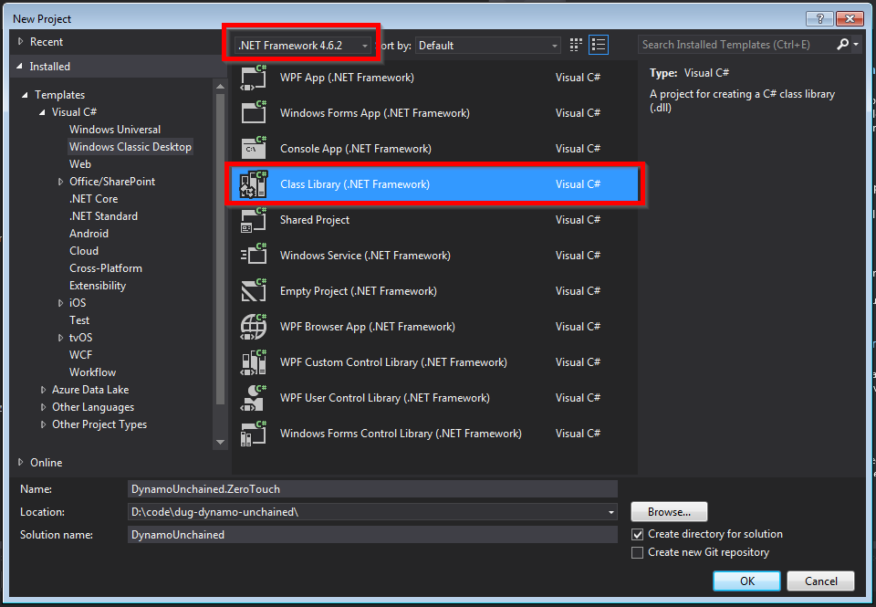
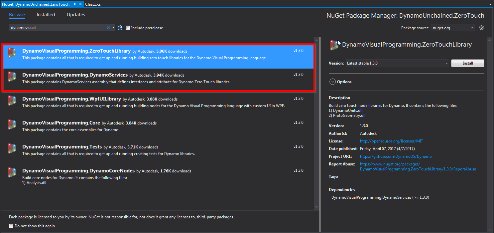
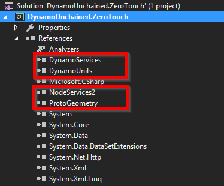
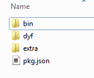
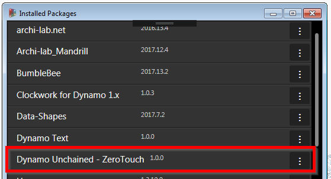
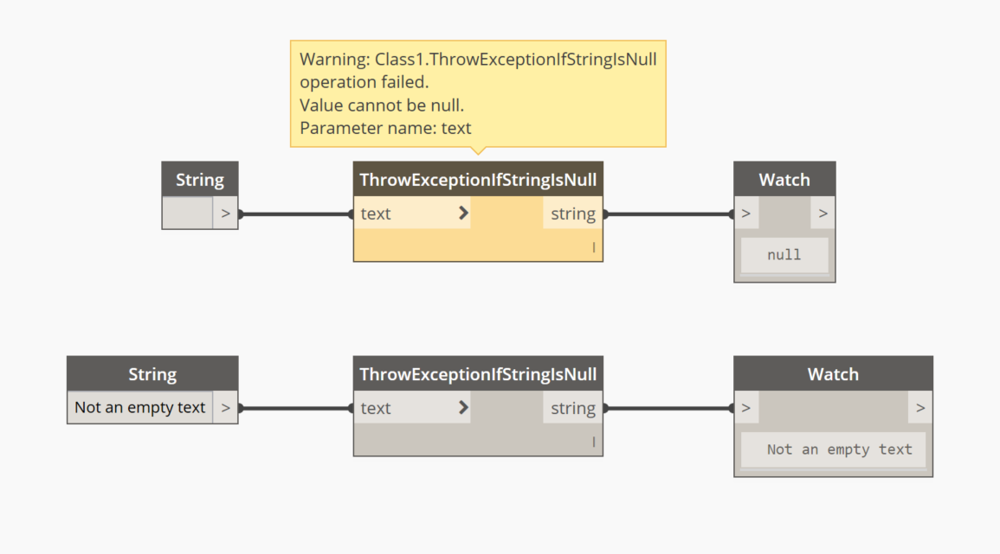
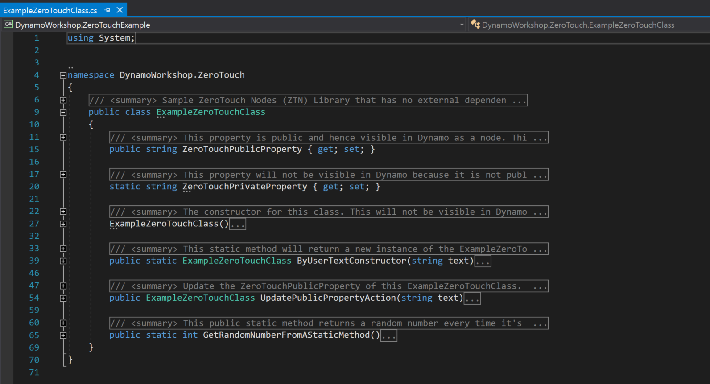

# AEC Hackathon Dynamo Workshop

## Part 1 - Zero Touch Nodes

Learn how to develop Zero Touch Nodes in C#.

## Summary

This workshop will teach you how to set your graph free by developing custom Dynamo nodes using the Zero Touch approach. It will go through the different types on nodes and their advantages, then it will teach you how to configure Visual Studio for development and debug. Finally, using simple examples, it will teach you how to build your own nodes.

After this workshop you will be able to add new features, improve workflows and contribute to the Dynamo community. 

The workshop will be using Visual Studio and C#, for information on getting started with C# please see the links in the [Additional Resources](https://github.com/radumg/AEC-hackathon-Dynamo-Workshop#additional-resources) section.

## Table of Contents

[Zero Touch Nodes](#zero-touch-nodes)

[1 - Visual Studio setup](#1---visual-studio-setup)
  - [New project](#new-project)
  - [References](#references)
  - [Package](#package)
  - [Build events & start action](#build-events-and-start-action)
  - [Hello Dynamo](#hello-dynamo)
  - [Debugging](#debugging)
  - [Naming](#naming)

[2 - Dynamo Node Development](#2---dynamo-node-development)
  - [Inputs](#inputs)
  - [Outputs](#outputs)
  - [Dynamo geometry](#dynamo-geometry)
  - [Exceptions](#exceptions)

[3 - ZeroTouch mapping](#3---zerotouch-mapping)
  - [Properties](#properties)
  - [Methods : instance/static](#methods)
  - [Static constructors](#static-constructors)

[4 - Revit Node Development](#4---revit-node-development)
  - [References](#references)
  - [Code Example 1 - GetWallBaseline](#code-example-1---getwallbaseline)
  - [Wrapping, Unwrapping and Converting](#wrapping-unwrapping-and-converting)
  - [Code example 2 - TextToWalls](#code-example-2---texttowalls)

## Zero Touch Nodes

A Zero Touch Node (ZTN), is a custom node written in C#. A ZTN can be obtained by simply [importing a DLL inside of Dynamo](http://dynamoprimer.com/en/10_Packages/10-5_Zero-Touch.html). It's called zero-touch because that's all you need to do : Dynamo is smart and will automatically map all methods & properties from public classes to nodes :
- `public static` **methods** that return the class type will appear as contructor nodes in Dynamo, identified with a green `+` icon
- `public` **methods** will appear as action nodes, identified with a red `⚡` icon
- `public` **properties** will appear as query nodes, identified with a blue `?` icon

By writing your own ZTN you will benefit from
- the .NET framework
- a solid IDE
- debugging tools
- and lots of libraries
- performance : C# nodes are more performant than Python ones most of the time. 

This type of node (ZTN) needs to be compiled into a `DLL` every time you want to make a change, which means your code is safer if you are going to distribute it, but it does make graphs dependant on this external `DLL` file. This means that for small tasks, Python nodes might still be a better solution as the code is embedded in the Dynamo `.dyn` file itself.

## 1 - Visual Studio Setup

[Visual Studio Community 2017](https://www.visualstudio.com/downloads/) (VS) is going to be our IDE, it’s free and fully-featured for students, open-source and individual developers. In this part we are going to create a new project, add references and packages and all necessary files. 
It’s very important to set up the project correctly : although it will take some time and it might look confusing at first, it will facilitate development and debugging, making you a better developer. Please note that this is how *I personally set up the environment*, there are of course many other ways to do it.

At the end of this part you'll have generated an empty boilerplate project which you can reuse in the future. You can find a the final files of this part inside the *"1 - Setup"* folder.

### New Project

Let’s create a new project:


The latest versions of Revit (2017/2018) use .NET Framework 4.6 (4.6.1 or 4.6.2), so if you are targeting a version prior to 2017, [change it accordingly](https://knowledge.autodesk.com/search-result/caas/CloudHelp/cloudhelp/2016/ENU/Revit-API/files/GUID-FEF0ED40-8658-4C69-934D-7F83FB5D5B63-htm.html). I used `ZeroTouch` as Project Name and `DynamoWorkshop` as Solution Name (a solution can contain multiple projects).



### References

To extend Dynamo at a very basic level (eg. manipulating native .NET data types like strings, numbers…) you don’t need to add any references. But if we want interact with Dynamo's geometry types, we need to add a few. We’ll be using NuGet, as it makes referencing super easy and it lets you build your node even without Dynamo or Revit installed.


For now we need `DynamoVisualProgramming.ZeroTouchLibrary` which depends on `DynamoVisualProgramming.DynamoServices` and will be downloaded automatically. Make sure they match your Dynamo version, in our case it's `2.0.1`.



You can see that 4 new dlls have been referenced:



Select them, right click and set *Copy Local* to *False* in the properties:


This will avoid unnecessary files in our package. Also note that Dynamo will not launch or debug properly if these DLLs are present in a package directory.

### Package

A zero touch node needs to be loaded in Dynamo manually each time or be added as a package. We’ll set it up as a **Local Package**, so that it will automatically load every time Dynamo starts. It will also make our life easier in case we decide to publish it to the official Dynamo Package Manager in the future.

Dynamo packages have the structure as per below:



* The *bin* folder houses .dll files created with C# or Zero-Touch libraries. This includes any external libraries you might need to reference in your code, such as Json.NET, RestSharp etc.

* The *dyf* folder houses any custom nodes, we won’t have any for this package.

* The *extra* folder houses all additional files. These files are likely to be Dynamo Files (.dyn) or any additional files required (.svg, .xls, .jpeg, .sat, etc.)

* The *pkg.json* file is a basic text file defining the package settings. [This can be created by Dynamo](http://dynamoprimer.com/en/10_Packages/10-4_Publishing.html), but we will make one from scratch.

We'll need to manually create this pkg.json file, but we'll automate the folder creation (we just need the _bin_ folder):

* Right Click on the project > Add > New Item…

* Web > JSON File

* Save as pkg.json


Then copy/paste the following package description, which is some boilerplate JSON code, into your newly-created `pkg.json` file :

```json
{
    "license": "",
    "file_hash": null,
    "name": "Dynamo Workshop - ZeroTouch",
    "version": "1.0.0",
    "description": "ZeroTouch sample node for the Dynamo workshop",
    "group": "",
    "keywords": null,
    "dependencies": [],
    "contents": "",
    "engine_version": "2.0.1.0",
    "engine": "dynamo",
    "engine_metadata": "",
    "site_url": "",
    "repository_url": "https://github.com/radumg/AEC-hackathon-Dynamo-Workshop",
    "contains_binaries": true,
    "node_libraries": [
        "DynamoWorkshop.ZeroTouch, Version=1.0.0.0, Culture=neutral, PublicKeyToken=null"
    ]
}
```
### Build Events and Start Action

Let’s finally configure the project so that the files are copied automatically into the Dynamo packages folder after each build, enabling us to debug our dlls after making changes.

Right click on the project > `Properties` > `Build Events` > `Post-build event command line` > paste the two following lines:

`xcopy /Y "$(TargetDir)*.*" "$(AppData)\Dynamo\Dynamo Core\2.0\packages\$(ProjectName)\bin\"`

`xcopy /Y "$(ProjectDir)pkg.json" "$(AppData)\Dynamo\Dynamo Core\2.0\packages\$(ProjectName)"`

These lines tell VisualStudio to copy into the package folder the `dlls` produced in the bin folder and the `pkg.json`.

> **Note:**
> The commands above point to the current version of Dynamo Sandbox, if you’re using a different version update accordingly. If you are using Dynamo for Revit you should instead use the following commands:
> `xcopy /Y "$(TargetDir)*.*" "$(AppData)\Dynamo\Dynamo Revit\2.0\packages\$(ProjectName)\bin\"`
>
> `xcopy /Y "$(ProjectDir)pkg.json" "$(AppData)\Dynamo\Dynamo Revit\2.0\packages\$(ProjectName)"`

Now right click on the project > `Properties` > `Debug` > `Start external program` > Select

`C:\Program Files\Dynamo\Dynamo Core\2\DynamoSandbox.exe`

> **Note:**
> The path above points to the current version of Dynamo Sandbox, if you’re using a different version edit accordingly. We are using Sandbox because it’s simpler and faster than Dynamo for Revit.
>
> If you are using Dynamo for Revit you should instead use the Revit path:
> `C:\Program Files\Autodesk\Revit 2018\Revit.exe`

> **Also note:**
> The start action is a user specific setting, not a project setting, you will have to set it again every time the project is cloned.


### Hello Dynamo!

It still looks a bit empty in here, let’s add some dummy code so that we can check everything is set up correctly. Add a new class named HelloDynamo.cs, or rename Class1.cs:

```c#
namespace DynamoWorkshop.ZeroTouch
{
  public static class HelloDynamo
  {
    public static string SayHello(string Name)
    {
      return "Hello " + Name + "!";
    }
  }
}
```
### Debugging

Before going ahead to debug our code, we need to change a VS setting. This is not required by Dynamo, but Revit instead, we'll do it now for peace of mind.  Go under *Tools > Options... > Debugging > General > Check "Use Managed Compatibility Mode"*. If Managed Compatibility Mode is unchecked and you try debugging within Revit it will crash during startup.


Press F5 or click the green play button to start debugging, Dynamo Sandbox should start automatically. Create a new file, and you should see our new package being loaded & appearing in the library :


Now, if you put some breakpoints in VS you’ll be able to get great insights into what’s going on in your code, which will help you fix bugs quicker and improve your dev skills too!

Since we set up our package as a local package, we can actually see it in the list of installed packages:



### Naming

One last thing, annoyingly enough, Dynamo didn’t format the Node Name very well. Our node was nested inside `DynamoWorkshop` > `ZeroTouch` > `DynamoWorkshop` > `ZeroTouch`.

The first two are taken from the assembly name (the DLL), the last two from the namespace, which in our case are the same.

To  avoid this you can either do the following 2 things:

* change assembly name (and change the corresponding value in pkg.json)

* add a *DynamoWorkshop.ZeroTouch_DynamoCustomization.xml* file

I prefer to keep my assembly names unchanged, so let’s add the XML file to the root of our project, then **remember to select it in VisualStudio and set its *Build Action* to _Copy always_****.**

```xml
<?xml version="1.0"?>
<doc>
  <assembly>
    <name>DynamoWorkshop.ZeroTouch</name>
  </assembly>
  <namespaces>
    <namespace name="DynamoWorkshop.ZeroTouch">
      <category>DynamoWorkshop.ZeroTouch</category>
    </namespace>
  </namespaces>
</doc>
```
Debug again, and it'll be much better now:


We’ve now finally set up our project correctly, you can save the project and use it in the future as a template. In case you missed some steps you can find the complete project inside the *"1 - Setup"* folder.

## 2 - Dynamo Node Development

In this part we will develop a few sample nodes exploring inputs, outputs, Dynamo's geometry and handling error/exceptions. Since we wont't be interacting with Revit just yet, development will target Dynamo Sandbox. Let’s dive straight in and see how to add more complex functionalities to our package.

### Input & Output (I/O)

Most of your nodes will :
- take one or more inputs
- do something with them
- and then return one or more outputs.

Let's look at each of those in a bit more detail. 

### Inputs

The first example is what we did in the previous exercise, a simple function that has 1 input text and returns a modified version of it :
```c#
public static string SayHello(string Name)
    {
      return "Hello " + Name + "!";
    }
```

To accept multiple inputs, simply add more input parameters to your functions.
```c#
public static double AverageNumbers(double Number1, double Number2)
{
  return (Number1 + Number2) / 2;
}
```


As you can clearly understand, the above will only accepts the declared input types, to accept any type you can use the `object` type. For lists/arrays, again, just follow normal C# conventions.

What if your input is not one, or two values, but an entire list ?
Let's see an example that handles a list as an input and returns that same list but without any of its contents :
```c#
public static IList ClearListContents(IList list)
{
  list.Clear();
  return list;
}
```

And then what happens if you don't know in advance the structure of the incoming data? What if you want to handle inputs with variable nesting and single items as well? Use the `[ArbitraryDimensionArrayImport]` attribute & make sure you  have the `using Autodesk.DesignScript.Runtime;` directive in your file:

```c#
public static IList AddItemToEnd([ArbitraryDimensionArrayImport] object item, IList list)
{
    return new ArrayList(list) //Clone original list
    {
        item //Add item to the end of cloned list.
    };
}
```
### Outputs

Returning multiple values is a little bit more tricky :
- first you need the `using Autodesk.DesignScript.Runtime;` directive
- then we need to add a `MultiReturn` attribute to the function
- and finally create a dictionary to store our outputs

Our first example that illustrates this is a function that takes in a list of integers and splits them into two distinct lists, each containing only odd or even numbers.

```c#
[MultiReturn(new[] { "evens", "odds" })]
public static Dictionary<string, object> SplitOddEven(List<int> list)
{
  var odds = new List<int>();
  var evens = new List<int>();

  //check integers in list if even or odd
  foreach (var i in list)
  {
    if (i % 2 == 0)
    {
      evens.Add(i);
    }
    else
    {
      odds.Add(i);
    }
  }

  //create a new dictionary and return it
  var d = new Dictionary<string, object>();
  d.Add("evens", evens);
  d.Add("odds", odds);
  return d;

  //the above can be simplified in one line with
  //return new Dictionary<string, object> { { "evens", evens }, { "odds", odds } };       
}
```


### Dynamo Geometry

To access native Dynamo geometry and methods, you just need to add the `using Autodesk.DesignScript.Geometry;` directive, we can now read element's properties.

The example below deconstructs a point into its X,Y & Z coordinates
```c#
[MultiReturn(new[] { "X", "Y", "Z" })]
public static Dictionary<string, object> DeconstructPoint(Point point)
{
  return new Dictionary<string, object> { 
    { "X", point.X }, 
    { "Y", point.Y }, 
    { "Z", point.Z } 
  };
}
```

And this one generates Dynamo geometry, creating a line from two X,Y,Z coordinates pairs.

```c#
public static Line LineByCoordinatesPair(double X1, double Y1, double Z1, double X2, double Y2, double Z2)
{
  var p1 = Point.ByCoordinates(X1, Y1, Z1);
  var p2 = Point.ByCoordinates(X2, Y2, Z2);

  return Line.ByStartPointEndPoint(p1, p2);
}
```
But **BE CAREFUL!** Each geometry object that you create in your functions will use Dynamo resources, therefore if it's not needed or returned by your methods it should be disposed, either like this:

```c#
public static Line LineByCoordinatesPair(double X1, double Y1, double Z1, double X2, double Y2, double Z2)
{
  var p1 = Point.ByCoordinates(X1, Y1, Z1);
  var p2 = Point.ByCoordinates(X2, Y2, Z2);
  var l = Line.ByStartPointEndPoint(p1, p2);
  p1.Dispose();
  p2.Dispose();
  return l;
}
```
Or with a `using` statement:

```c#
public static Line ByCoordinates(double X1, double Y1, double Z1, double X2, double Y2, double Z2)
{
  using (var p1 = Point.ByCoordinates(X1, Y1, Z1))
  {
    using (var p2 = Point.ByCoordinates(X2, Y2, Z2))
    {
      return Line.ByStartPointEndPoint(p1, p2);
    }
  }
}
```

### Exceptions

When writing any method, it's good practice to check the validity of your inputs (parameters) first and raising exceptions if anything is invalid, therefore halting executing of that method and not executing any un-necessary code.

In C#, raising an exception is as simple as :

```c#
throw new Exception("This is the message that will accompany the exception.");
```

Doing this inside a Dynamo node is gracefully handled by Dynamo, turning the node yellow and displaying the error message. Let's see an example :

```c#
public static string ThrowExceptionIfStringIsNull(string text)
{
    if (string.IsNullOrWhiteSpace(text)) throw new ArgumentNullException("text");
    return text;
}
```

Which will be displayed like this in Dynamo :



If we were doing something a bit more complicated, we might want to handle errors & exceptions ourselves inside our node and only surface the error to the users when it can't be ignored, or with more detailed information about it.

Here's an example that handles exceptions internally, but also surfaces them when needed. What it does is calculate the sum of all list members, but it skips over null values, which would otherwise cause an `Exception` to be thrown when trying to add them up.

```c#
public static int HandleListNullExceptionsInternally(List<object> list)
{
    // check input list is not empty
    if (list == null || list.Count < 1) throw new ArgumentNullException("list");
    var sum = 0;

    foreach (var item in list)
    {
        try
        {
            // it's safe to throw inside a try block as the exception will be caught below
            if (item == null) throw new NullReferenceException();

            // if the object cannot be converted to an integer, this will throw an exception as well
            int intValue = Convert.ToInt32(item);

            // this only executes if the above checks did not throw
            sum += intValue;
        }
        catch (Exception)
        {
            // this block of code would be executed whenever a null is found in the list
        }
    }

    return sum;
}
```

In case you missed some steps you can find the complete project inside the *"2 - Input Output"* folder.

## 3 - ZeroTouch mapping

As mentioned before, Dynamo will automatically map `public` properties and methods to nodes, so let's see a more applied example of this.

Open up the example solution and you should see this


### Properties
Let's look at how properties get mapped to nodes.

```c#
// This property is public and hence visible in Dynamo as a node.
// This displays in Dynamo as a Query node, identified with a blue ? icon.
public string ZeroTouchPublicProperty { get; set; }

// This property will not be visible in Dynamo because it is not public.
static string ZeroTouchPrivateProperty { get; set; }
```

### Methods
Methods all get mapped to nodes, as long they are `public`, whether `static` or not.

Static methods are straight-forward :
```c#
// This public static method returns a random number every time it's executed.
// Notice how the node Dynamo creates does not require an instance of an ExampleZeroTouchClass as input.
public static int GetRandomNumberFromAStaticMethod()
{
  return new Random().Next();
}
```
results in this node


Non-static methods are also turned into node. Let's see an example :
```c#
public ExampleZeroTouchClass UpdatePublicPropertyAction(string text)
{
  this.ZeroTouchPublicProperty = text;
  return this;
}
```
Because this method is not static, notice how Dynamo adds another input to the resulting node, asking for an instance of ExampleZeroTouchClass :


### Static constructors
Methods that return the same type as the the class they belong to are treated differently if they are also `static`, being rendered as constructor nodes.

Let's see an example method :
```c#
// This static method will return a new instance of the ExampleZeroTouchClass, with the ZeroTouchPublicProperty set to the text provided.
// This displays in Dynamo as a Constructor node, identified with a green + icon.
public static ExampleZeroTouchClass ByUserTextConstructor(string text)
{
  var newInstance = new ExampleZeroTouchClass();
  newInstance.ZeroTouchPublicProperty = text;
  return newInstance;
}
```
In Dynamo, this will look like this :


Let's visualise all these mappings from C# code to nodes to understand the direct relationship :


In case you missed some steps you can find the complete project inside the *"3 - ZeroTouch mapping"* folder.


## 4 - Revit Node Development

Everything covered so far will run smoothly in Dynamo Sandbox and it's great to use it to get started developing nodes, but soon enough you'll want to be interacting with Revit elements too. A great feature of zero touch nodes is that they'll let you use the Revit and Dynamo API at the same time! This might be a bit confusing at first, but we'll see soon how to do that and the [revitapidocs](http://www.revitapidocs.com/) website is great to get familiar with the Revit API. 

The Revit elements you access inside of Dynamo are not the native ones, but are *wrappers* around them, we'll also see more in detail what this means.

### References

We need to add 3 more references manually, as these don't come as NuGet packages.

In your VisualStudio project, right click on `References` > `Add Reference` > `Browse`...


Browse and add the following DLLs, the first to the Revit API:

`C:\Program Files\Autodesk\Revit 2018\RevitAPI.dll`

Then to the Dynamo Revit Nodes and Services

`C:\Program Files\Dynamo\Dynamo Revit\2.0\Revit_2018\RevitNodes.dll`

`C:\Program Files\Dynamo\Dynamo Revit\2.0\Revit_2018\RevitServices.dll`

Again, remember to select these newly added references and to set *Copy Local* to *False*.


As mentioned earlier, since now we'll be building and debugging for Revit, you now need to update your [start action and build events](#Start-Action-and-Build-Events).

> **Note:**
> The Revit API libraries (dlls) are guaranteed to be valid for use only with the version of Revit they came with. This means that if you reference the `RevitAPI.dll` file from your Revit 2018 installation, your nodes will work with Revit 2018, might work with later versions (2019, etc) and will probably not work with older versions (2017). Targeting multiple versions of Revit is doable however, see [Konrad's excellent tutorial](http://archi-lab.net/how-to-maintain-revit-plug-ins-for-multiple-versions/) for more information.

### Code Example 1 - GetWallBaseline

In this example, we'll write a node that takes in a Revit wall and outputs its baseline as a Dynamo curve.

Let's create a new `public static class` named `HelloRevit`. We will need to add the following directives corresponding to the new references:

```c#
using Autodesk.Revit.DB;
using Revit.Elements;
using RevitServices.Persistence;
```
If now you create a new method that uses the `Wall` object, for instance, you'll see the following error:


Visual Studio, isn't sure if we mean a native Revit wall or a Dynamo wall. We can fix that by typing the full namespace as:


Let's now explore how we can write a node that takes in some Walls and outputs their baseline curves. Write a new function:

```c#
public static Autodesk.DesignScript.Geometry.Curve GetWallBaseline(Revit.Elements.Wall wall)
{
  //get Revit Wall element from the Dynamo-wrapped object
  var revitWall = wall.InternalElement;
  //get the location curve of the wall using the Revit API
  var locationCurve =  revitWall.Location as LocationCurve;
  //convert the curve to Dynamo and return it
  return locationCurve.Curve.ToProtoType();
}
```
This isn't too exciting, but hey, you wrote your first ZTN for Revit! The code also shows us how to *unwrap* a Dynamo wall to get the native Revit one, and how to *convert* a Revit curve into a Dynamo one, a fundamental part of zero touch nodes.

### Wrapping, Unwrapping and Converting

The following lists show some of the most common extension methods that you might need, they take care of conversion of Revit elements and geometry to Dynamo ones and vice-versa.

You can find these extension methods in the `RevitNodes.dll` assembly that comes with every Dynamo installation. Again, this will be versioned due to Revit's API, so look for it in the folder below, adjusting for your version of Revit & Dynamo :
`C:\Program Files\Dynamo\Dynamo Revit\2.0\Revit_2018\RevitNodes.dll`

#### From Revit to Dynamo

```c#
//Elements
Element.ToDSType(bool); //true if it's an element generated by Revit
//Geometry
XYZ.ToPoint() > Point
XYZ.ToVector() > Vector
Point.ToProtoType() > Point
List<XYZ>.ToPoints() > List<Point>
UV.ToProtoType() > UV
Curve.ToProtoType() > Curve
CurveArray.ToProtoType() > PolyCurve
PolyLine.ToProtoType() > PolyCurve
Plane.ToPlane() > Plane
Solid.ToProtoType() > Solid
Mesh.ToProtoType() > Mesh
IEnumerable<Mesh>.ToProtoType() > Mesh[]
Face.ToProtoType() > IEnumerable<Surface>
Transform.ToCoordinateSystem() > CoordinateSystem
BoundingBoxXYZ.ToProtoType() > BoundingBox
```
#### From Dynamo to Revit

```c#
//Elements
Element.InternalElement
//Geometry
Point.ToRevitType() > XYZ
Vector.ToRevitType() > XYZ
Plane.ToPlane() > Plane
List<Point>.ToXyzs() > List<XYZ>
Curve.ToRevitType() > Curve
PolyCurve.ToRevitType() > CurveLoop
Surface.ToRevitType() > IList<GeometryObject>
Solid.ToRevitType() > IList<GeometryObject>
Mesh.ToRevitType() > IList<GeometryObject>
CoordinateSystem.ToTransform() > Transform
CoordinateSystem.ToRevitBoundingBox() > BoundingBoxXYZ
BoundingBox.ToRevitType() > BoundingBoxXYZ
```


### Code Example 2 - TextToWalls

We're now going to do something more complex, we will write a custom node that takes in a string, converts the text shape into lines and uses those lines to place walls.

Create a new `TextUtils` class as below:

```c#
using System.Collections.Generic;
using System.Linq;
using Autodesk.DesignScript.Runtime;
using Autodesk.DesignScript.Geometry;
using System.Drawing;
using System.Drawing.Drawing2D;

namespace DynamoWorkshop.ZeroTouch
{
  public static class TextUtils
  {
    /// <summary>
    /// Converts a string into a list of segments
    /// </summary>
    /// <param name="text">String to convert</param>
    /// <param name="size">Text size</param>
    /// <returns></returns>
    [IsVisibleInDynamoLibrary(false)] // this attribute will prevent this method from showing up in Dynamo as a node
    public static IEnumerable<Line> TextToLines(string text, int size)
    {
      List<Line> lines = new List<Line>();

      //using System.Drawing for the conversion to font points
      using (Font font = new System.Drawing.Font("Arial", size, FontStyle.Regular))
      using (GraphicsPath gp = new GraphicsPath())
      using (StringFormat sf = new StringFormat())
      {
        sf.Alignment = StringAlignment.Center;
        sf.LineAlignment = StringAlignment.Center;

        gp.AddString(text, font.FontFamily, (int)font.Style, font.Size, new PointF(0, 0), sf);

        //convert font points to Dynamo points
        var points = gp.PathPoints.Select(p => Autodesk.DesignScript.Geometry.Point.ByCoordinates(p.X, -p.Y, 0)).ToList();
        var types = gp.PathTypes;

        Autodesk.DesignScript.Geometry.Point start = null;
        //create lines
        for (var i = 0; i < types.Count(); i++)
        {
          //Types:
          //0 start of a shape
          //1 point in line
          //3 point in curve
          //129 partial line end
          //131 partial curve end
          //161 end of line
          //163 end of curve
          if (types[i] == 0)
          {
            start = points[i];
          }
          //some letters need to be closed other no
          if (types[i] > 100)
          {
            if (!points[i].IsAlmostEqualTo(start))
            {
              lines.Add(Line.ByStartPointEndPoint(points[i], start));
            }
          }
          else
          {
            lines.Add(Line.ByStartPointEndPoint(points[i], points[i + 1]));
          }
        }
        //dispose points
        foreach (var point in points)
        {
          point.Dispose();
        }
        return lines;
      }
    }
  }
}
```
We don't need to get into detail, this class simply converts a string text into lines, note the `[IsVisibleInDynamoLibrary(false)]` attribute that prevents it from showing up in Dynamo. For it to work you need to add a reference to `System.Drawing` in References > Add Reference... > Assemblies > Framework.


Now we need to add a few more things to our class.

First, we add a `Document` member, which uses the Revit API to get a reference to the currently open document (`.rvt` file) inside Revit. Remember, collecting & creating elements always happens in the context of a Revit document.
```c#
internal static Autodesk.Revit.DB.Document Document
{
  get { return DocumentManager.Instance.CurrentDBDocument; }
}
```

Now add a new `SayHello` method to the `HelloRevit` class, which will take a string, a wall height, a level, a wall type and an optional font size.
```c#
public static IEnumerable<Revit.Elements.Wall> SayHello(string text, double height, Revit.Elements.Level level, Revit.Elements.WallType wallType, int fontSize = 25)
{

}
```

Before proceeding we need to make sure some of these input arguments are valid:

```c#
  if (level == null)
  {
    throw new ArgumentNullException("level");
  }

  if (wallType == null)
  {
    throw new ArgumentNullException("wallType");
  }
```
Then we can call our utility method to generate the lines from the text with:

```c#
var lines = TextUtils.TextToLines(text, fontSize);
```

Now, you'd be very tempted to write something like the loop below, using the Dynamo API for generating new walls, but beware! Because of an intrinsic mechanism called *element binding* (that can't be turned off), the loop would only return a single element.  The right way to loop and generate multiple elements is using the Revit API.

Dynamo API (wrong method):

```c#
  var walls = new List<Revit.Elements.Wall>();
  foreach (var curve in lines)
  {      
      walls.Add(Revit.Elements.Wall.ByCurveAndHeight(curve, height, level, wallType));
  }
```
Revit API (right method):

```c#
  var walls = new List<Revit.Elements.Wall>();
  //elements creation and modification has to be inside of a transaction
  TransactionManager.Instance.EnsureInTransaction(Document);
  foreach (var curve in lines)
  {
    // use the Revit Wall.Create API to make a new wall element
      var wall = Autodesk.Revit.DB.Wall.Create(
        Document, // note the required reference to the Revid Document
        curve.ToRevitType(), // also note we need to convert Dynamo curves to Revit types
        wallType.InternalElement.Id, // Revit elements returned from Dynamo are wrapped, so we need to access the internal element directly
        level.InternalElement.Id, 
        height, 
        0.0, 
        false, 
        false);
      walls.Add(wall.ToDSType(false) as Revit.Elements.Wall); // notice we need to wrap Revit elements back so they can be used in Dynamo
  }
```
Whenever you are using the Revit API to create or modify elements, these methods need to be wrapped inside a transaction. This is handled automatically when calling Dynamo methods.

After this, the last code example is complete, you can now debug the project and see the node in action, mind to use the right units for *height* and *size*, as in my case where the project is in meters:


In case you missed some steps you can find the complete project inside the *"4 - Revit nodes"* folder.


## Conclusion

The boilerplate project we have created in part 1 should get you jump-started in developing for Dynamo. Don't be afraid of Visual Studio, it's a friend and it can provide very helpful insights during development and debugging. 

We have also gone through sample code on how to interact with Dynamo and Revit geometry/elements, so you should now be able to start developing your own nodes. 

We recommend following Part 2 of this workshop next, teaching you how to develop Explicit nodes in Dynamo, but in the meantime, here's some additional things to be aware of:

* Version updates - releasing updates to an existing node should be done carefully, it could brake existing user graphs and workflows. Most developers choose to use the [SemVer](https://semver.org/) method to number versions, which also helps aleviate & communicate the impacts of changes to users. 

* Dll conflicts - if other nodes in use by Dynamo depend on external dlls, and your nodes too, there might be conflicts. Dynamo will report any conflicts in its `Notifications` panel, so check it out if something is misbehaving!


## Next
Let's kick this up a notch by learning to build Explicit nodes !
Head over to [Part 2](https://github.com/radumg/AEC-hackathon-Dynamo-Workshop/tree/master/Part%202%20-%20Explicit%20nodes) of the workshop.
