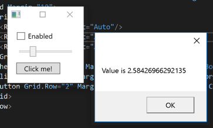
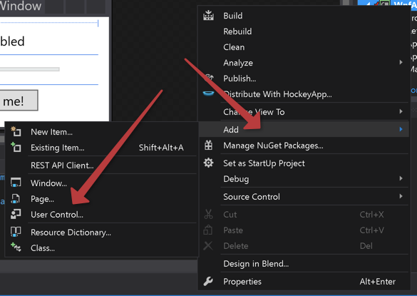
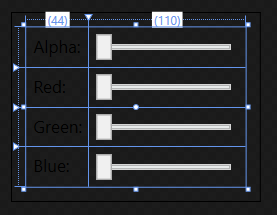
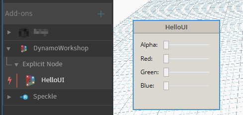
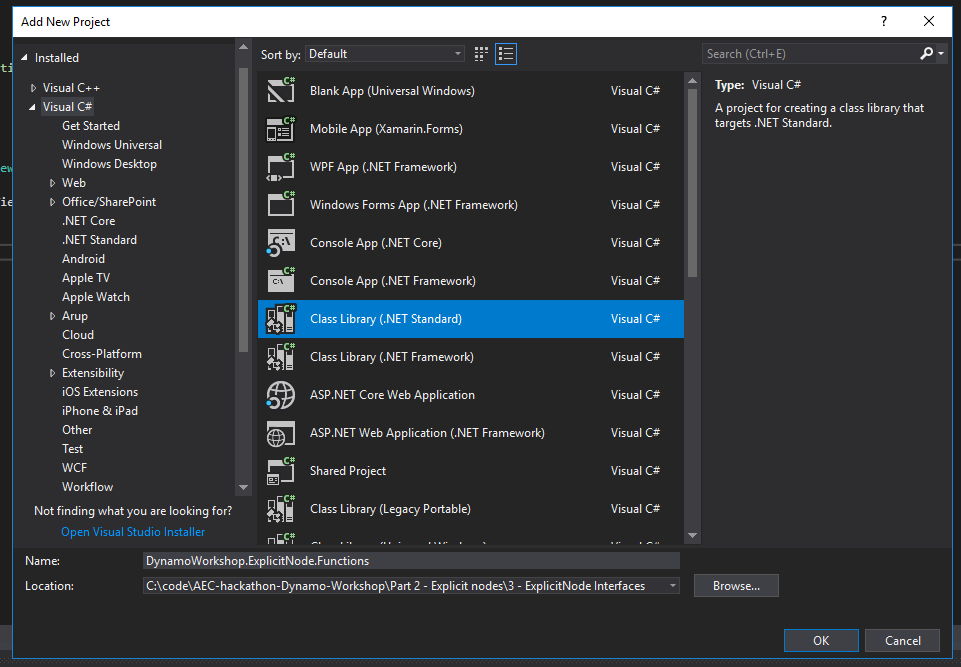
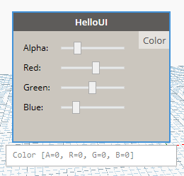

# AEC Hackathon Dynamo Workshop

## Part 2 - Explicit Nodes

Learn how to develop Explicit Nodes in C#.

## Summary

This workshop will teach you how to develop explicit nodes with a custom UI. This approach is more advanced and complicated than the Zero Touch one, but nodes built this way have the most flexibility and power.

You will learn how to implement a custom UI, respond to other nodes and affect the state of the graph. You will also learn how to package your nodes and distribute them using the Dynamo Package Manager. 

The workshop will be using Visual Studio and C#, an intermediate level of programming knowledge is needed, for additional information see the links in the [Additional Resources](https://github.com/radumg/AEC-hackathon-Dynamo-Workshop#additional-resources) section.

## Table of Contents

[1 - Getting started with WPF](#1---getting-started-with-wpf)
  - [Sample app](#sample-app)
  - [WPF binding](#wpf-binding)
  - [User controls](#user-controls)

[2 - ExplicitNode Interfaces](#2---explicitnode-interfaces)
  - [The NodeModel interface](#the-nodemodel-interface)
  - [The Custom UI](#the-custom-ui)
  - [The INodeViewCustomization interface](#the-inodeviewcustomization-interface)

[3 - ExplicitNode Functions](#3---explicitnode-functions)
  - [Executing functions](#executing-functions)
  - [The BuildOutputAst method](#the-buildoutputast-method)
  - [Affecting the graph](#affecting-the-graph)

[Publishing nodes to the Package Manager](#publishing-nodes-to-the-package-manager)

## 1 - Getting started with WPF

In the previous lab we have seen how to develop Zero Touch Nodes, which are great to add custom functionalities, but do not give us total control over the node's behaviour. In order to customize its UI, and to affect the state of the node and the graph an explicit custom node is needed. Explicit custom nodes are more complex and use Windows Presentation Foundation (WPF) a powerful UI framework for building Windows applications.

### Sample App

Let's first make a simple WPF application, to see how it works. Open Visual Studio and create a new WPF App project:


You'll see a MainWindow.cs and a MainWindow.xaml, XAML (eXtensible Application Markup Language) is Microsoft's variant of XML for describing a GUI.

Now double click on MainWindow.xaml, expand the toolbox panel and add some UI controls as a slider, a checkbox and a button:


As you see VS has automatically created XAML tags corresponding to these UI elements, let's now edit it so that from these controls we can call methods in the C# code behind. We are going to add names to the controls, set `Grid.RowDefinitions` to better layout the controls, change a few properties and add a `Click` event to the button:

```xml
<Window x:Class="WpfApp.MainWindow"
        xmlns="http://schemas.microsoft.com/winfx/2006/xaml/presentation"
        xmlns:x="http://schemas.microsoft.com/winfx/2006/xaml"
        xmlns:d="http://schemas.microsoft.com/expression/blend/2008"
        xmlns:mc="http://schemas.openxmlformats.org/markup-compatibility/2006"
        xmlns:local="clr-namespace:WpfApp"
        mc:Ignorable="d"
        Title="MainWindow" SizeToContent="WidthAndHeight">
  <Grid Margin="10">
    <Grid.RowDefinitions>
      <RowDefinition Height="Auto"/>
      <RowDefinition Height="Auto"/>
      <RowDefinition Height="Auto"/>
    </Grid.RowDefinitions>
    <CheckBox Grid.Row="0" Margin="5" Name="EnabledCheckBox" Content="Enabled" HorizontalAlignment="Left" VerticalAlignment="Top"/>
    <Slider Grid.Row="1" Margin="5" Name="ValueSlider" HorizontalAlignment="Left"  VerticalAlignment="Top" Width="100"/>
    <Button Grid.Row="2" Margin="5" Click="Button_Click" Content="Click me!" HorizontalAlignment="Left"  VerticalAlignment="Top" Width="75"/>
  </Grid>
</Window>
```

Now in the code behind (MainWindow.cs) we can add the following function that will show up a 'MessageBox' with the slider value when the button is clicked:

```c#
private void Button_Click(object sender, RoutedEventArgs e)
{
  MessageBox.Show("Value is " + ValueSlider.Value);
}
```

Run the application and you'll see it working!



### WPF Binding

A very powerful feature of WPF is binding, it provides a simple and consistent way for applications to present and interact with data. Let's see what it means with a simple example, edit your button XAML code by adding `IsEnabled="{Binding ElementName=EnabledCheckBox, Path=IsChecked}"`, it will look like:

```xml
<Button
  Grid.Row="2"
  Width="75"
  Margin="5"
  HorizontalAlignment="Left"
  VerticalAlignment="Top"
  Click="Button_Click"
  Content="Click me!"
  IsEnabled="{Binding ElementName=EnabledCheckBox, Path=IsChecked}" />
```

If you run the app you'll see that as the checkbox is unchecked the button becomes disabled, we have bound the checkbox `IsChecked` property to the button status. Binding not only works between components, but also with the code behind.

### User Controls

Let's finally see how easy it is in WPF to create custom controls, right click on the project > Add > User Control and create a new one, I named mine `MyCustomControl.xaml`.



Now, from the XAML panel replace the content of `<Grid>...</Grid>` in `MyCustomControl.xaml` with the one in `MainWindow.xaml`. As do the same for our `Button_Click` function in `MainWindow.xaml.cs` and move it to `MyCustomControl.xaml.cs`.

We have now created a reusable custom control that we can embed inside other WPF controls. To add it to `MainWindow.xaml` we just need to save and add the `  xmlns:local="clr-namespace:WpfApp"` attribute to the `<Window>` element as below and a  `<local:MyCustomControl/>` XAML tag for this custom component inside the XAML `<Grid>` :


If you build and run the application you'll see it behaves exactly how it did before.

## 2 - ExplicitNode Interfaces

Let's now see how to use our User Control inside a custom UI node. Open the empty project inside `2 - ExplicitNode Start`, this was set up in the same way we did in the previous lab, the only additional dependency, which can be installed via NuGet, is the WpfUILibrary:


### The NodeModel interface

Custom UI nodes implement the NodeModel **interface**, the same way native nodes do. An interface is like an abstract base class, any class that implements the interface must implement all its members. Basically you'll just have to add  `:NodeModel` after the class name, and have certain functions in your class.

Create a new class named `HelloUI.cs`, then add the interface, directives and attributes as below:

```c#
/* dynamo directives */
using Dynamo.Graph.Nodes;
using Newtonsoft.Json;
using System.Collections.Generic;

namespace DynamoWorkshop.ExplicitNode
{
  [NodeName("HelloUI")]
  [NodeDescription("Sample Explicit Node")]
  [NodeCategory("DynamoWorkshop.Explicit Node")]
  [IsDesignScriptCompatible]
  public class HelloUI : NodeModel
  {
    //Json Constructor for Dynamo 2.0 nodes
    [JsonConstructor]
    private HelloUI(IEnumerable<PortModel> inPorts, IEnumerable<PortModel> outPorts) : base(inPorts, outPorts)
    {
    }

    public HelloUI()
    {

    }
  }
}

```

As you can see in Dynamo 2.0 there are 2 constructors:  the original parameterless constructor is used to initialize a new nodes created within Dynamo (via the library for example). The JSON constructor is required to initialize a node that is deserialized *(loaded)* from a saved .dyn or .dyf file. 

More on JSON constructors can be found here: [github.com/DynamoDS/Dynamo/wiki/Update-Packages-from-1.3-to-2.0](https://github.com/DynamoDS/Dynamo/wiki/Update-Packages-from-1.3-to-2.0#json-constructors)

In explicit nodes there is no need for a `_DynamoCustomization.xml` file, as the attributes on top of our class will define its category, name & whether it's usable in code blocks.

### The Custom UI

We have seen in the previous chapter how to create a WPF control, we'll now create a similar one that the node will use as UI.

Create a new UserControl `ColorSelector.xaml` with the code below:

```c#
<UserControl
  x:Class="DynamoWorkshop.ExplicitNode.ColorSelector"
  xmlns="http://schemas.microsoft.com/winfx/2006/xaml/presentation"
  xmlns:x="http://schemas.microsoft.com/winfx/2006/xaml"
  xmlns:d="http://schemas.microsoft.com/expression/blend/2008"
  xmlns:local="clr-namespace:DynamoWorkshop.ExplicitNode"
  xmlns:mc="http://schemas.openxmlformats.org/markup-compatibility/2006"
  mc:Ignorable="d">
  <Grid Margin="10">
    <Grid.RowDefinitions>
      <RowDefinition Height="Auto" />
      <RowDefinition Height="Auto" />
      <RowDefinition Height="Auto" />
      <RowDefinition Height="Auto" />
    </Grid.RowDefinitions>
    <Grid.ColumnDefinitions>
      <ColumnDefinition Width="Auto" />
      <ColumnDefinition Width="Auto" />
    </Grid.ColumnDefinitions>
    <Label
      Grid.Row="0"
      Grid.Column="0"
      Content="Alpha:" />
    <Label
      Grid.Row="1"
      Grid.Column="0"
      Content="Red:" />
    <Label
      Grid.Row="2"
      Grid.Column="0"
      Content="Green:" />
    <Label
      Grid.Row="3"
      Grid.Column="0"
      Content="Blue:" />
    <Slider
      Name="SliderA"
      Grid.Row="0"
      Grid.Column="1"
      Width="100"
      Margin="5"
      HorizontalAlignment="Left"
      VerticalAlignment="Top"
      IsSnapToTickEnabled="True"
      Maximum="255"
      Minimum="0"
      TickFrequency="1"
      Value="{Binding SliderValueA}" />
    <Slider
      Name="SliderR"
      Grid.Row="1"
      Grid.Column="1"
      Width="100"
      Margin="5"
      HorizontalAlignment="Left"
      VerticalAlignment="Top"
      IsSnapToTickEnabled="True"
      Maximum="255"
      Minimum="0"
      TickFrequency="1"
      Value="{Binding SliderValueR}" />
    <Slider
      Name="SliderG"
      Grid.Row="2"
      Grid.Column="1"
      Width="100"
      Margin="5"
      HorizontalAlignment="Left"
      VerticalAlignment="Top"
      IsSnapToTickEnabled="True"
      Maximum="255"
      Minimum="0"
      TickFrequency="1"
      Value="{Binding SliderValueG}" />
    <Slider
      Name="SliderB"
      Grid.Row="3"
      Grid.Column="1"
      Width="100"
      Margin="5"
      HorizontalAlignment="Left"
      VerticalAlignment="Top"
      IsSnapToTickEnabled="True"
      Maximum="255"
      Minimum="0"
      TickFrequency="1"
      Value="{Binding SliderValueB}" />
  </Grid>
</UserControl>

```

As you can see from the preview, it's just a grid with 4 sliders.



### The INodeViewCustomization Interface

Since our node has a custom UI, we need to create another class which implements the INodeViewCustomization interface. Create a new class named `HelloUINodeView.cs` and add:

```c#
/* dynamo directives */
using Dynamo.Controls;
using Dynamo.ViewModels;
using Dynamo.Wpf;

namespace DynamoWorkshop.ExplicitNode
{
  public class HelloUINodeView : INodeViewCustomization<HelloUI>
  {
    private DynamoViewModel dynamoViewModel;
    private HelloUI helloUiNode;

    public void CustomizeView(HelloUI model, NodeView nodeView)
    {
      dynamoViewModel = nodeView.ViewModel.DynamoViewModel;
      helloUiNode = model;
      var ui = new ColorSelector();
      nodeView.inputGrid.Children.Add(ui);
      ui.DataContext = model;
    }

    public void Dispose()
    {
    }
  }
}
```

The code above is very important:

- `nodeView.inputGrid.Children.Add(ui);` is adding our custom control to the node UI
- `ui.DataContext = model;` is binding our HelloUI class as view model of the custom UI
- we are not using the `dynamoViewModel` but it's really powerful as it's the view model of the entire Dynamo application

If you debug, you'll see the node with the user control embedded, behaving as before, but without any input or output port.

 If you've missed any step you can find this completed part in the folder `3 - ExplicitNode Interfaces`.




## 3 - ExplicitNode Functions

In this final part we are going to add more bindings to the UI, add an output port, and have our node return something. 

### More bindings

Add the following fields and properties to `HelloUI.cs`:

```c#
    private int _sliderValueA;
    private int _sliderValueR;
    private int _sliderValueB;
    private int _sliderValueG;
    public int SliderValueA { get => _sliderValueA;  set { _sliderValueA = value; RaisePropertyChanged("SliderValueA"); }}
    public int SliderValueR { get => _sliderValueR;  set { _sliderValueR = value; RaisePropertyChanged("SliderValueR"); } }
    public int SliderValueB { get => _sliderValueB;  set { _sliderValueB = value; RaisePropertyChanged("SliderValueB"); }}
    public int SliderValueG { get => _sliderValueG;  set { _sliderValueG = value; RaisePropertyChanged("SliderValueG"); } }
```

If you debug your code now you'll see the binding to the UI sliders.

### Executing functions

NodeModels when executed run a method called `BuildOutputAst` this method takes your inputs and passes them to a function **which has to live in a separate assembly** (in our case a separate project). Let's create it:



Then let's add the `DynamoVisualProgramming.DynamoServices` NuGet package and the `System.Drawing ` reference.

Then create a new static class named `Functions.cs`:

```c#
using Autodesk.DesignScript.Runtime;
using System.Drawing;

namespace DynamoWorkshop.ExplicitNode.Functions
{
  [IsVisibleInDynamoLibrary(false)]
  public static class Functions
  {
    public static Color ColorByARGB(int a, int r, int g, int b)
    {
      return Color.FromArgb(a, r, g, b);
    }
  }
}
```

### The BuildOutputAst method

Now we can implement `BuildOutputAst` inside of `HelloUI.cs`. First right click on the`DynamoWorkshop.ExplicitNode` project and add a reference to `DynamoWorkshop.ExplicitNode.Functions`.


Then add the `BuildOutputAst` function to HelloUI.cs:

```c#
    public override IEnumerable<AssociativeNode> BuildOutputAst(List<AssociativeNode> inputAstNodes)
    {
      var sliderValueA = AstFactory.BuildDoubleNode(SliderValueA);
      var sliderValueR = AstFactory.BuildDoubleNode(SliderValueR);
      var sliderValueG = AstFactory.BuildDoubleNode(SliderValueG);
      var sliderValueB = AstFactory.BuildDoubleNode(SliderValueB);

      var functionCall =
        AstFactory.BuildFunctionCall(
          new Func<int, int, int, int, System.Drawing.Color>(Functions.Functions.ColorByARGB),
          new List<AssociativeNode> { sliderValueA, sliderValueR, sliderValueG, sliderValueB });

      return new[] { AstFactory.BuildAssignment(GetAstIdentifierForOutputIndex(0), functionCall) };
    }
```

And the `OutPort` attributes on the node:

```c#
  [OutPortNames("Color")]
  [OutPortTypes("color")]
  [OutPortDescriptions("Selected Color")]
```

Your `HelloUI.cs` should look like this:

```c#
using System;
using System.Collections.Generic;
using System.Linq;
/* dynamo directives */
using Dynamo.Graph.Nodes;
using Newtonsoft.Json;
using ProtoCore.AST.AssociativeAST;

namespace DynamoWorkshop.ExplicitNode
{
  [NodeName("HelloUI")]
  [NodeDescription("Sample Explicit Node")]
  [NodeCategory("DynamoWorkshop.Explicit Node")]
  [OutPortNames("Color")]
  [OutPortTypes("color")]
  [OutPortDescriptions("Selected Color")]
  [IsDesignScriptCompatible]
  public class HelloUI : NodeModel
  {
    //Json Constructor for Dynamo 2.0 nodes
    [JsonConstructor]
    private HelloUI(IEnumerable<PortModel> inPorts, IEnumerable<PortModel> outPorts) : base(inPorts, outPorts)
    {
    }

    public HelloUI()
    {
      RegisterAllPorts();
    }

    private int _sliderValueA;
    private int _sliderValueR;
    private int _sliderValueB;
    private int _sliderValueG;
    public int SliderValueA { get => _sliderValueA;  set { _sliderValueA = value; RaisePropertyChanged("SliderValueA"); }}
    public int SliderValueR { get => _sliderValueR;  set { _sliderValueR = value; RaisePropertyChanged("SliderValueR"); } }
    public int SliderValueB { get => _sliderValueB;  set { _sliderValueB = value; RaisePropertyChanged("SliderValueB"); }}
    public int SliderValueG { get => _sliderValueG;  set { _sliderValueG = value; RaisePropertyChanged("SliderValueG"); } }

    public override IEnumerable<AssociativeNode> BuildOutputAst(List<AssociativeNode> inputAstNodes)
    {
      var sliderValueA = AstFactory.BuildDoubleNode(SliderValueA);
      var sliderValueR = AstFactory.BuildDoubleNode(SliderValueR);
      var sliderValueG = AstFactory.BuildDoubleNode(SliderValueG);
      var sliderValueB = AstFactory.BuildDoubleNode(SliderValueB);

      var functionCall =
        AstFactory.BuildFunctionCall(
          new Func<int, int, int, int, System.Drawing.Color>(Functions.Functions.ColorByARGB),
          new List<AssociativeNode> { sliderValueA, sliderValueR, sliderValueG, sliderValueB });

      return new[] { AstFactory.BuildAssignment(GetAstIdentifierForOutputIndex(0), functionCall) };
    }
  }
}
```

And finally, we need to tell Dynamo to load `DynamoWorkshop.ExplicitNode.Functions.dll` as well, and that's done by editing `pkg.json` adding at the end:

```json
"node_libraries": [
    "DynamoWorkshop.ExplicitNode, Version=1.0.0.0, Culture=neutral, PublicKeyToken=null",
    "DynamoWorkshop.ExplicitNode.Functions, Version=1.0.0.0, Culture=neutral, PublicKeyToken=null"
  ]
```

If we test the code we can see the OutPort, but it's not changing when the sliders change. We need to Expire the node for it to happen!



### Expiring the node

Fortunately enough, expiring the node is easy. Just call `OnNodeModified()` to do so. In our case we'll add that to the setter methods of each or our SliderValues:

```c#
    public int SliderValueA { get => _sliderValueA;  set { _sliderValueA = value; RaisePropertyChanged("SliderValueA"); OnNodeModified(); }}
    public int SliderValueR { get => _sliderValueR;  set { _sliderValueR = value; RaisePropertyChanged("SliderValueR"); OnNodeModified(); } }
    public int SliderValueB { get => _sliderValueB;  set { _sliderValueB = value; RaisePropertyChanged("SliderValueB"); OnNodeModified(); } }
    public int SliderValueG { get => _sliderValueG;  set { _sliderValueG = value; RaisePropertyChanged("SliderValueG"); OnNodeModified(); } }
```

It could be cleaner, but it'll work for now.

### Final touch

As a final touch, let's preview the color generated by the sliders in the Node UI. This can be done with `INodeViewCustomization` as it gives us access to the Dynamo `NodeView`, the class that defines the nodes default appearance.

In `HelloUINodeView.cs`, add references to namespaces `System.Windows.Media` and `System.Windows.Shapes`. Then, add to `CustomizeView` method the following event handlers to track when the sliders are moved.


```c#
      using System.Windows.Media;
      using System.Windows.Shapes;
```

```c#
      ui.SliderA.ValueChanged += Slider_ValueChanged;
      ui.SliderR.ValueChanged += Slider_ValueChanged;
      ui.SliderG.ValueChanged += Slider_ValueChanged;
      ui.SliderB.ValueChanged += Slider_ValueChanged;
```

and then add the following method:

```c#
private void Slider_ValueChanged(object sender, System.Windows.RoutedPropertyChangedEventArgs<double> e)
{

  ((Rectangle)_nodeview.grid.FindName("nodeBackground")).Fill = new SolidColorBrush(Color.FromArgb(
                                                Convert.ToByte(_model.SliderValueA), 
                                                Convert.ToByte(_model.SliderValueR),
                                                Convert.ToByte(_model.SliderValueG), 
                                                Convert.ToByte(_model.SliderValueB)));
}
```
The node background color will now change accordingly.


### Serializing / Deserializing nodes

If you save the custom node in a definition and load it again you will see that the sliders value persisted, that's because it's being serialized with the node.

Dynamo 2.0 makes it very easy to serialize / deserialize variables on custom nodes. To do that, a variable needs to be `public`, and it will be automatically saved and loaded.

To ignore a property or a field, use the `[JsonIgnore]` attribute and it'll be skipped.


## Publishing nodes to the Package Manager

Publishing a package to the package manager is a very simple process especially given how we have set up our Visual Studio projects. 

**Only publish packages that you own and that you have tested thoroughly!**

Publishing can only be done from Dynamo for Revit or Dynamo Studio, not from the Sandbox version.

Click on Packages > Manage Packages...


Next to your package, click the 3 dots and then Publish:


In the next screen make sure all the information are correct and that only the required dlls are being included (remember when we had to manually set `Copy Local` to `False` on the references?). These field can be modified in pkg.json.


As you click Publish Online it will be on the Package Manager, to upload new version use Publish Version... instead.

Note that packages **cannot be deleted or renamed**, but only deprecated.  

## Conclusion

We have seen the principles behind explicit custom nodes, and this workshop has given you the basis to get started with development. 

There are some technical challenges but also great benefits if you decide to build and use this type of custom node. WPF is a very powerful and widely useful framework, you'll be able to find lots of resources online and existing UI components to reuse. 

We have also seen how to publish your nodes online and contribute to the Dynamo community, if is a very straightforward process once you have set up your project correctly.

Happy coding!
