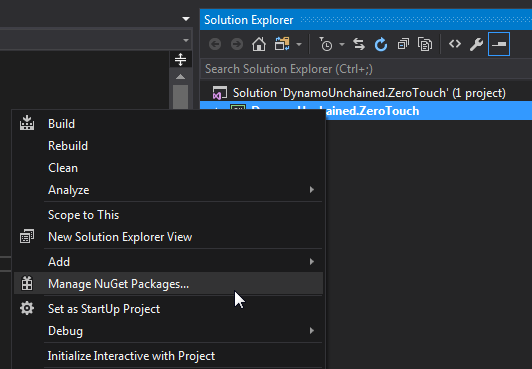
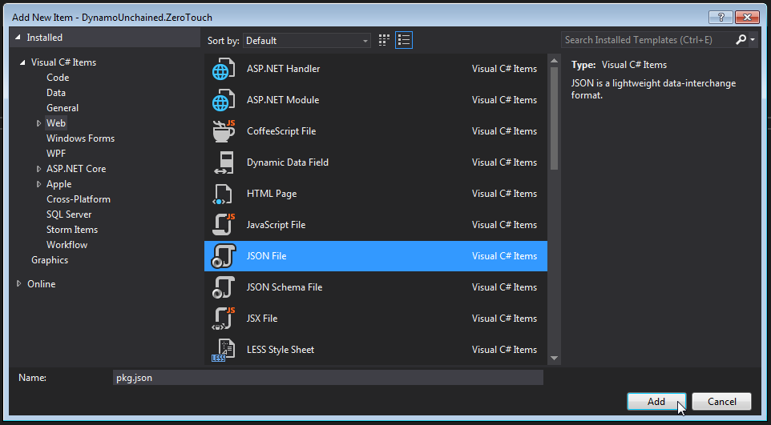
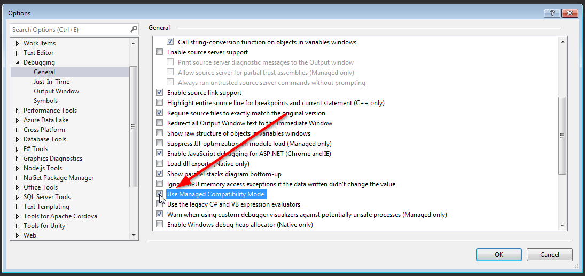
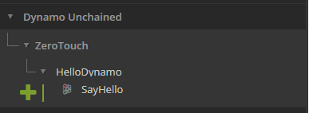
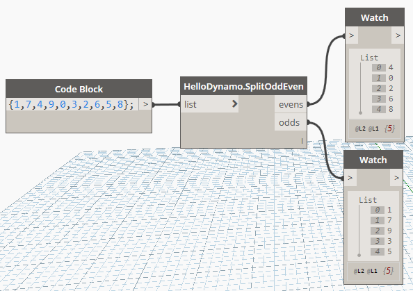
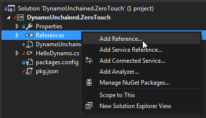
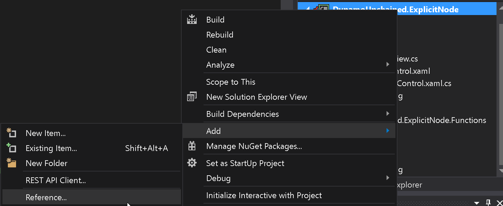
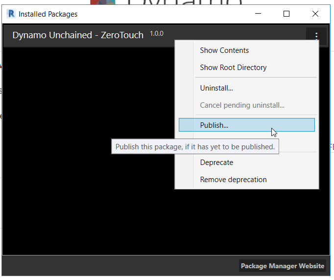
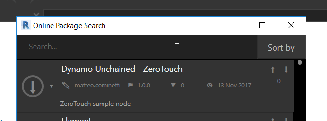

# AEC Hackathon Dynamo Workshop

Learn how to develop Zero Touch Nodes in C#.

## Summary

This workshop will teach you how to set your graph free by developing custom Dynamo nodes using the Zero Touch approach. It will go thorough the different types on nodes and their advantages, then it will teach you how to configure Visual Studio for development and debug. Finally, using simple examples, it will teach you how to build your own nodes.
After this workshop you will be able to add new features, improve workflows and contribute to the Dynamo community.  The workshop will be using Visual Studio and C#, for information on getting started with C# please see the links in the [Additional Resources](#Additional Resources) section.

This workshop will teach you how to set your graph free by developing explicit nodes with a custom UI. This approach is more advanced and complicated than the Zero Touch one, but nodes built this way have the most flexibility and power. You will learn how to implement a custom UI, respond to other nodes and affect the state of the graph. You will also learn how to package your nodes and distribute them using the Dynamo Package Manager. The workshop be using Visual Studio and C#, an intermediate level of programming knowledge is needed, for additional information see the links in the [Additional Resources](#Additional Resources) section.

### Learning objectives

* Learn about the different types of custom Dynamo nodes
* Lear how to set up the Visual Studio environment for development and debug with Dynamo
* Learn how to develop, test and deploy a Zero Touch node
* Learn how to develop, test and deploy explicit custom Dynamo nodes
* Learn how to implement a custom UI
* Lear how to publish your nodes using the package manager

### Tools we’ll use

* [Visual Studio Community 2017](https://www.visualstudio.com/downloads/)

* Autodesk Revit 2018 (or Autodesk Revit 2017 and Dynamo 1.3)

## What are custom nodes?

In Dynamo it is possible to add custom functionalities using special components, these are called custom nodes. They can be really useful for frequently used routines or for adding completely new and advanced features.

### Advantages

* Simplify the graph, keep it clean and intuitive

* Reusability

* Modularity, update all custom nodes of the same type at once

* Better use of conditional statements (if/then) and looping

* Add brand new functionalities

* Integrate with external services/libraries

* Understand better how Dynamo "thinks"

* Contribute to the community

### Disadvantages

* Less intuitive than visual programming

* Hard for novice users/learning curve

* Some custom nodes require compiling DLLs

* With great power comes great responsibility, custom nodes are more prone to bugs, memory abuse or crashes

### Types of custom nodes

There are different types of custom nodes, for all levels and uses:

* *[Dynamo Custom Node](http://dynamoprimer.com/en/09_Custom-Nodes/9-2_Creating.html)*, it’s done by nesting existing nodes into a container, the custom node is saved as a DYF file and can be easily shared

* *[Code Node](http://dynamobim.org/cbns-for-dummies/)*, this one basically consists in having a formula inside a code node, you can’t do complex things but if can be very handy. The code is in Design Script

* *[Python Node](http://dynamoprimer.com/en/09_Custom-Nodes/9-4_Python.html)*, it’s a custom node containing python code, supports modules and packages. It is a very powerful and quick way to add custom functionalities, and you don’t need to compile your code. ([template](https://github.com/DynamoDS/Dynamo/pull/8034))

* *Zero Touch Node*, create or import a custom node written in C#. It is a more complex choice but you will benefit of the .NET framework, a solid IDE, debugging tools and lots of libraries

* *Explicit Custom Node*, basically a native Dynamo node written in C#, it implements the NodeModel interface, can have a custom UI and affect the state of the graph

### Zero Touch Node

A Zero Touch Node (ZTN), is a custom node written in C#. A ZTN can be obtained by simply [importing a DLL inside of Dynamo](http://dynamoprimer.com/en/10_Packages/10-5_Zero-Touch.html). It's called zero-touch because that's all you need to do : Dynamo is smart and will automatically map all methods & properties from public classes to nodes :
- `public static` **methods** will appear as contructor nodes in Dynamo, identified with a green `+` icon
- `public` **methods** will appear as action nodes, identified with a red `⚡` icon
- `public` **properties** will appear as query nodes, identified with a blue `?` icon

By writing your own ZTN you will benefit from
- the .NET framework
- a solid IDE
- debugging tools
- and lots of libraries
- performance : C# nodes are more performant than Python ones most of the time. 

This type of node (ZTN) needs to be compiled into a `DLL` every time you want to make a change, which means your code is safer if you are going to distribute it, but it does make graphs dependant on this external `DLL` file. This means that for small tasks, Python nodes might still be a better solution as the code is embedded in the Dynamo `.dyn` file itself.

## Visual Studio Setup - Part 1

[Visual Studio Community 2017](https://www.visualstudio.com/downloads/) (VS) is going to be our IDE, it’s free and fully-featured for students, open-source and individual developers. In this part we are going to create a new project, add references and packages and all necessary files. 
It’s very important to set up the project correctly : although it will take some time and it might look confusing at first, it will facilitate development and debugging, making you a better developer. Please note that this is how *I personally set up the environment*, there are of course many other ways to do it.

At the end of this part you'll have generated an empty boilerplate project which you can reuse in the future. You can find a the final files of this part inside the "*DynamoWorkshop.ZeroTouch - part 1"* folder.

### New Project

Let’s create a new project:


The latest versions of Revit (2017/2018) use .NET Framework 4.6 (4.6.1 or 4.6.2), so if you are targeting a version prior to 2017, [change it accordingly](https://knowledge.autodesk.com/search-result/caas/CloudHelp/cloudhelp/2016/ENU/Revit-API/files/GUID-FEF0ED40-8658-4C69-934D-7F83FB5D5B63-htm.html). I used `DynamoWorkshop.ZeroTouch` as Project Name and `DynamoWorkshop` as Solution Name (a solution can contain multiple projects).


### References

To extend Dynamo at a very basic level (eg. manipulating native .NET data types like strings, numbers…) you don’t need to add any references. But if we want interact with Dynamo's geometry types, we need to add a few. We’ll be using NuGet, as it makes referencing super easy and it lets you build your node even without Dynamo or Revit installed.



For now we need `DynamoVisualProgramming.ZeroTouchLibrary` which depends on `DynamoVisualProgramming.DynamoServices` and will be downloaded automatically. Make sure they match your Dynamo version.


You can see that 4 new dlls have been referenced:


Select them and set *Copy Local* to *False* in the properties:


This will avoid unnecessary files in our package.

### Package

A zero touch node needs to be loaded by Dynamo manually each time or be added as a package. We’ll set it up as a **Local Package**, so that it will automatically load every time Dynamo starts. It will also make our life easier in case we decide to publish it to the official Dynamo Package Manager in the future.

Dynamo packages have the structure as per below:


* The *bin* folder houses .dll files created with C# or Zero-Touch libraries

* The *dyf* folder houses any custom nodes, we won’t have any for this package

* The *extra* folder houses all additional files. These files are likely to be Dynamo Files (.dyn) or any additional files required (.svg, .xls, .jpeg, .sat, etc.)

* The *pkg.json* file is a basic text file defining the package settings. [This is can be automated by Dynamo](http://dynamoprimer.com/en/10_Packages/10-4_Publishing.html), but we will make one from scratch.

We'll need to manually create this pkg.json file, but we'll automate the folder creation (we just need the _bin_ folder):

* Right Click on the project > Add > New Item…

* Web > JSON File

* Save as pkg.json



Then copy/paste the following package description, which is some boilerplate JSON code, into your newly-created `pkg.json` file :

```json
{
    "license": "",
    "file_hash": null,
    "name": "Dynamo Workshop - ZeroTouch",
    "version": "1.0.0",
    "description": "ZeroTouch sample node for the Dynamo workshop",
    "group": "",
    "keywords": null,
    "dependencies": [],
    "contents": "",
    "engine_version": "1.3.0.0",
    "engine": "dynamo",
    "engine_metadata": "",
    "site_url": "",
    "repository_url": "",
    "contains_binaries": true,
    "node_libraries": [
        "DynamoWorkshop.ZeroTouch, Version=1.0.0.0, Culture=neutral, PublicKeyToken=null"
    ]
}
```
### Build Events and Start Action

Let’s finally configure the project so that the files are copied automatically into the Dynamo packages folder after each build, enabling us to debug our dlls after making changes.

Right click on the project > `Properties` > `Build Events` > `Post-build event command line` > paste the two following lines:

`xcopy /Y "$(TargetDir)*.*" "$(AppData)\Dynamo\Dynamo Core\1.3\packages\$(ProjectName)\bin\"`

`xcopy /Y "$(ProjectDir)pkg.json" "$(AppData)\Dynamo\Dynamo Core\1.3\packages\$(ProjectName)"`

These lines tell VisualStudio to copy into the package folder the `dlls` produced in the bin folder and the `pkg.json`.

> **Note:**
> The commands above point to the current version of Dynamo Sandbox, if you’re using a different version update accordingly. If you are using Dynamo for Revit you should instead use the following commands:
> `xcopy /Y "$(TargetDir)*.*" "$(AppData)\Dynamo\Dynamo Revit\1.3\packages\$(ProjectName)\bin\"`
>
> `xcopy /Y "$(ProjectDir)pkg.json" "$(AppData)\Dynamo\Dynamo Revit\1.3\packages\$(ProjectName)"`

Now right click on the project > `Properties` > `Debug` > `Start external program` > Select

`C:\Program Files\Dynamo\Dynamo Revit\1.3\DynamoSandbox.exe`

> **Note:**
> The path above points to the current version of Dynamo Sandbox, if you’re using a different version edit accordingly. We are using Sandbox because it’s simpler and faster than Dynamo for Revit.
>
> If you are using Dynamo for Revit you should instead use the Revit path:
> `C:\Program Files\Autodesk\Revit 2018\Revit.exe`

> **Also note:**
> The start action is a user specific setting, not a project setting, you will have to set it again every time the project is cloned.


### Hello Dynamo!

It still looks a bit empty in here, let’s add some dummy code so that we can check everything is set up correctly. Add a new class named HelloDynamo.cs, or rename Class1.cs:

```c#
namespace DynamoWorkshop.ZeroTouch
{
  public static class HelloDynamo
  {
    public static string SayHello(string Name)
    {
      return "Hello " + Name + "!";
    }
  }
}
```
### Debugging

Before going ahead to debug our code, we need to change a VS setting. This is not required by Dynamo, but Revit instead, we'll do it now for peace of mind.  Go under *Tools > Options... > Debugging > General > Check "Use Managed Compatibility Mode"*. If Managed Compatibility Mode is unchecked and you try debugging within Revit it will crash during startup.



Press F5 or click the green play button to start debugging, Dynamo Sandbox should start automatically. Create a new file, and you should see our new package being loaded & appearing in the library :


Now, if you put some breakpoints in VS you’ll be able to get great insights into what’s going on in your code, which will help you fix bugs quicker and improve your dev skills too!

Since we set up our package as a local package, we can actually see it in the list of installed packages:


### Naming

One last thing, annoyingly enough, Dynamo didn’t format the Node Name very well. Our node was nested inside `DynamoWorkshop` > `ZeroTouch` > `DynamoWorkshop` > `ZeroTouch`.

The first two are taken from the assembly name (the DLL), the last two from the namespace, which in our case are the same.

To  avoid this you can either do the following 2 things:

* change assembly name (and change the corresponding value in pkg.json)

* add a *DynamoWorkshop.ZeroTouch_DynamoCustomization.xml* file

I prefer to keep my assembly names unchanged, so let’s add the XML file to the root of our project, then **remember to select it in VisualStudio and set its *Build Action* to _Copy always_****.**

```xml
<?xml version="1.0"?>
<doc>
  <assembly>
    <name>DynamoWorkshop.ZeroTouch</name>
  </assembly>
  <namespaces>
    <namespace name="DynamoWorkshop.ZeroTouch">
      <category>DynamoWorkshop.ZeroTouch</category>
    </namespace>
  </namespaces>
</doc>
```
Debug again, and it'll be much better now:




We’ve now finally set up our project correctly, you can save the project and use it in the future as a template. In case you missed some steps you can find the complete project inside the "*DynamoWorkshop.ZeroTouch - part 1"* folder.

## Dynamo Node Development - Part 2

In this part we will develop a few sample nodes exploring inputs, outputs and Dynamo's geometry. Since we wont't be interacting with Revit just yet, development will target Dynamo Sandbox. As mentioned previously, each `public` method that you have in your project will show up as a node in Dynamo. Let’s now see how to add more complex functionalities.

### Input & Output (I/O)

Most of your nodes will :
- take one or more inputs
- do something with them
- and then return one or more outputs.

#### Inputs

To accept multiple inputs, simply add more input parameters to your functions:

```c#
public static double AverageNumbers(double Number1, double Number2)
{
  return (Number1 + Number2) / 2;
}
```


As you can clearly understand, the above will only accepts the declared input types, to accept any type you can use the `object` type. For lists/arrays, again, just follow normal C# conventions.

But what happens if you don't know in advance the structure of the incoming data? What if you want to handle inputs with variable nesting and single items as well? Use the `[ArbitraryDimensionArrayImport]` attribute & make sure you  have the `using Autodesk.DesignScript.Runtime;` directive in your file:

```c#
public static IList AddItemToEnd([ArbitraryDimensionArrayImport] object item, IList list)
{
    return new ArrayList(list) //Clone original list
    {
        item //Add item to the end of cloned list.
    };
}
```
#### Outputs

Returning multiple values is a little bit more tricky :
- first you need the `using Autodesk.DesignScript.Runtime;` directive
- then we need to add a `MultiReturn` attribute to the function
- and finally create a dictionary to store our outputs

```c#
[MultiReturn(new[] { "evens", "odds" })]
public static Dictionary<string, object> SplitOddEven(List<int> list)
{
  var odds = new List<int>();
  var evens = new List<int>();

  //check integers in list if even or odd
  foreach (var i in list)
  {
    if (i % 2 == 0)
    {
      evens.Add(i);
    }
    else
    {
      odds.Add(i);
    }
  }

  //create a new dictionary and return it
  var d = new Dictionary<string, object>();
  d.Add("evens", evens);
  d.Add("odds", odds);
  return d;

  //the above can be simplified in one line with
  //return new Dictionary<string, object> { { "evens", evens }, { "odds", odds } };       
}
```





### Dynamo Geometry

To access native Dynamo geometry and methods, you just need to add the `using Autodesk.DesignScript.Geometry;` directive, we can now read element's properties:

```c#
[MultiReturn(new[] { "X", "Y", "Z" })]
public static Dictionary<string, object> PointCoordinates(Point point)
{
  return new Dictionary<string, object> { 
    { "X", point.X }, 
    { "Y", point.Y }, 
    { "Z", point.Z } 
  };
}
```

And generate new geometry:

```c#
public static Line ByCoordinates(double X1, double Y1, double Z1, double X2, double Y2, double Z2)
{
  var p1 = Point.ByCoordinates(X1, Y1, Z1);
  var p2 = Point.ByCoordinates(X2, Y2, Z2);

  return Line.ByStartPointEndPoint(p1, p2);
}
```
But **BE CAREFUL!** Each geometry object that you create in your functions will use Dynamo resources, therefore if it's not needed or returned by your methods it should be disposed, either like this:

```c#
public static Line ByCoordinates(double X1, double Y1, double Z1, double X2, double Y2, double Z2)
{
  var p1 = Point.ByCoordinates(X1, Y1, Z1);
  var p2 = Point.ByCoordinates(X2, Y2, Z2);
  var l = Line.ByStartPointEndPoint(p1, p2);
  p1.Dispose();
  p2.Dispose();
  return l;
}
```
Or with a `using` statement:

```c#
public static Line ByCoordinates(double X1, double Y1, double Z1, double X2, double Y2, double Z2)
{
  using (var p1 = Point.ByCoordinates(X1, Y1, Z1))
  {
    using (var p2 = Point.ByCoordinates(X2, Y2, Z2))
    {
      return Line.ByStartPointEndPoint(p1, p2);
    }
  }
}
```

### Exceptions

When writing any method, it's good practice to check the validity of your inputs (parameters) first and raising exceptions if anything is invalid, therefore halting executing of that method and not executing any un-necessary code.

In C#, raising an exception is as simple as :

```c#
throw new Exception("This is the message that will accompany the exception.");
```

Doing this inside a Dynamo node is gracefully handled by Dynamo, turning the node yello and displaying the error message. Let's see an example :

```c#
public static string ThrowExceptionIfStringIsNull(string text)
    {
      if (string.IsNullOrWhiteSpace(text)) throw new ArgumentNullException("text");
      return text;
    }
```

Which will be displayed like this in Dynamo :


## Revit Node Development - Part 3

Everything covered so far will run smoothly in Dynamo Sandbox and it's great to use it to get started developing nodes, but soon enough you'll want to be interacting with Revit elements too. A great feature of zero touch nodes is that they'll let you use the Revit and Dynamo API at the same time! This might be a bit confusing at first, but we'll see soon how to do that and the [revitapidocs](http://www.revitapidocs.com/) website is great to get familiar with the Revit API. 

The Revit elements you access inside of Dynamo are not the native ones, but are *wrappers* around them, we'll also see more in detail what this means.

### References

We need to add 3 more references manually, as these don't come as NuGet packages.

In your VisualStudio project, right click on `References` > `Add Reference` > `Browse`...




Browse and add the following DLLs, the first to the Revit API:

`C:\Program Files\Autodesk\Revit 2018\RevitAPI.dll`

Then to the Dynamo Revit Nodes and Services

`C:\Program Files\Dynamo\Dynamo Revit\1.3\Revit_2018\RevitNodes.dll`

`C:\Program Files\Dynamo\Dynamo Revit\1.3\Revit_2018\RevitServices.dll`

Again, remember to select these newly added references and to set *Copy Local* to *False*.


As mentioned earlier, since now we'll be building and debugging for Revit, you now need to update your [start action and build events](#Start-Action-and-Build-Events).

> **Note:**
> The Revit API libraries (dlls) are guaranteed to be valid for use only with the version of Revit they came with. This means that if you reference the `RevitAPI.dll` file from your Revit 2018 installation, your nodes will work with Revit 2018, might work with later versions (2019, etc) and will probably not work with older versions (2017). Targeting multiple versions of Revit is doable however, see [Konrad's excellent tutorial](http://archi-lab.net/how-to-maintain-revit-plug-ins-for-multiple-versions/) for more information.

### Code Example 1 - GetWallBaseline

In this example, we'll write a node that takes in a Revit wall and outputs its baseline as a Dynamo curve.

Let's create a new `public static class` named `HelloRevit`. We will need to add the following directives corresponding to the new references:

```c#
using Autodesk.Revit.DB;
using Revit.Elements;
using RevitServices.Persistence;
```
If now you create a new method that uses the `Wall` object, for instance, you'll see the following error:


Visual Studio, isn't sure if we mean a native Revit wall or a Dynamo wall. We can fix that by typing the full namespace as:


Let's now explore how we can write a node that takes in some Walls and outputs their baseline curves. Write a new function:

```c#
public static Autodesk.DesignScript.Geometry.Curve GetWallBaseline(Revit.Elements.Wall wall)
{
  //get Revit Wall element from the Dynamo-wrapped object
  var revitWall = wall.InternalElement;
  //get the location curve of the wall using the Revit API
  var locationCurve =  revitWall.Location as LocationCurve;
  //convert the curve to Dynamo and return it
  return locationCurve.Curve.ToProtoType();
}
```
This isn't too exciting, but hey, you wrote your first ZTN for Revit! The code also shows us how to *unwrap* a Dynamo wall to get the native Revit one, and how to *convert* a Revit curve into a Dynamo one, a fundamental part of zero touch nodes.

### Wrapping, Unwrapping and Converting

The following lists show some of the most common extension methods that you might need, they take care of conversion of Revit elements and geometry to Dynamo ones and vice-versa.

#### From Revit to Dynamo

```c#
//Elements
Element.ToDSType(bool); //true if it's an element generated by Revit
//Geometry
XYZ.ToPoint() > Point
XYZ.ToVector() > Vector
Point.ToProtoType() > Point
List<XYZ>.ToPoints() > List<Point>
UV.ToProtoType() > UV
Curve.ToProtoType() > Curve
CurveArray.ToProtoType() > PolyCurve
PolyLine.ToProtoType() > PolyCurve
Plane.ToPlane() > Plane
Solid.ToProtoType() > Solid
Mesh.ToProtoType() > Mesh
IEnumerable<Mesh>.ToProtoType() > Mesh[]
Face.ToProtoType() > IEnumerable<Surface>
Transform.ToCoordinateSystem() > CoordinateSystem
BoundingBoxXYZ.ToProtoType() > BoundingBox
```
#### From Revit to Dynamo

```c#
//Elements
Element.InternalElement
//Geometry
Point.ToRevitType() > XYZ
Vector.ToRevitType() > XYZ
Plane.ToPlane() > Plane
List<Point>.ToXyzs() > List<XYZ>
Curve.ToRevitType() > Curve
PolyCurve.ToRevitType() > CurveLoop
Surface.ToRevitType() > IList<GeometryObject>
Solid.ToRevitType() > IList<GeometryObject>
Mesh.ToRevitType() > IList<GeometryObject>
CoordinateSystem.ToTransform() > Transform
CoordinateSystem.ToRevitBoundingBox() > BoundingBoxXYZ
BoundingBox.ToRevitType() > BoundingBoxXYZ
```


### Code Example 2 - TextToWalls

We're now going to do something more complex, we will write a custom node that takes in a string, converts the text shape into lines and uses those lines to place walls.

Create a new `TextUtils` class as below:

```c#
using System.Collections.Generic;
using System.Linq;
using Autodesk.DesignScript.Runtime;
using Autodesk.DesignScript.Geometry;
using System.Drawing;
using System.Drawing.Drawing2D;

namespace DynamoWorkshop.ZeroTouch
{
  public static class TextUtils
  {
    /// <summary>
    /// Converts a string into a list of segments
    /// </summary>
    /// <param name="text">String to convert</param>
    /// <param name="size">Text size</param>
    /// <returns></returns>
    [IsVisibleInDynamoLibrary(false)] // this attribute will prevent this method from showing up in Dynamo as a node
    public static IEnumerable<Line> TextToLines(string text, int size)
    {
      List<Line> lines = new List<Line>();

      //using System.Drawing for the conversion to font points
      using (Font font = new System.Drawing.Font("Arial", size, FontStyle.Regular))
      using (GraphicsPath gp = new GraphicsPath())
      using (StringFormat sf = new StringFormat())
      {
        sf.Alignment = StringAlignment.Center;
        sf.LineAlignment = StringAlignment.Center;

        gp.AddString(text, font.FontFamily, (int)font.Style, font.Size, new PointF(0, 0), sf);

        //convert font points to Dynamo points
        var points = gp.PathPoints.Select(p => Autodesk.DesignScript.Geometry.Point.ByCoordinates(p.X, -p.Y, 0)).ToList();
        var types = gp.PathTypes;

        Autodesk.DesignScript.Geometry.Point start = null;
        //create lines
        for (var i = 0; i < types.Count(); i++)
        {
          //Types:
          //0 start of a shape
          //1 point in line
          //3 point in curve
          //129 partial line end
          //131 partial curve end
          //161 end of line
          //163 end of curve
          if (types[i] == 0)
          {
            start = points[i];
          }
          //some letters need to be closed other no
          if (types[i] > 100)
          {
            if (!points[i].IsAlmostEqualTo(start))
            {
              lines.Add(Line.ByStartPointEndPoint(points[i], start));
            }
          }
          else
          {
            lines.Add(Line.ByStartPointEndPoint(points[i], points[i + 1]));
          }
        }
        //dispose points
        foreach (var point in points)
        {
          point.Dispose();
        }
        return lines;
      }
    }
  }
}
```
We don't need to get into detail, this class simply converts a string text into lines, note the `[IsVisibleInDynamoLibrary(false)]` attribute that prevents it from showing up in Dynamo. For it to work you need to add a reference to `System.Drawing` in References > Add Reference... > Assemblies > Framework.


Now we need to add a few more things to our class.

First, we add a `Document` member, which uses the Revit API to get a reference to the currently open document (`.rvt` file) inside Revit. Remember, collecting & creating elements always happens in the context of a Revit document.
```c#
internal static Autodesk.Revit.DB.Document Document
{
  get { return DocumentManager.Instance.CurrentDBDocument; }
}
```

Now add a new `SayHello` method to the `HelloRevit` class, which will take a string, a wall height, a level, a wall type and an optional font size.
```c#
public static IEnumerable<Revit.Elements.Wall> SayHello(string text, double height, Revit.Elements.Level level, Revit.Elements.WallType wallType, int fontSize = 25)
{

}
```

Before proceeding we need to make sure some of these input arguments are valid:

```c#
  if (level == null)
  {
    throw new ArgumentNullException("level");
  }

  if (wallType == null)
  {
    throw new ArgumentNullException("wallType");
  }
```
Then we can call our utility method to generate the lines from the text with:

```c#
var lines = TextUtils.TextToLines(text, fontSize);
```

Now, you'd be very tempted to write something like the loop below, using the Dynamo API for generating new walls, but beware! Because of an intrinsic mechanism called *element binding* (that can't be turned off), the loop would only return a single element.  The right way to loop and generate multiple elements is using the Revit API.

Dynamo API (wrong method):

```c#
  var walls = new List<Revit.Elements.Wall>();
  foreach (var curve in lines)
  {      
      walls.Add(Revit.Elements.Wall.ByCurveAndHeight(curve, height, level, wallType));
  }
```
Revit API (right method):

```c#
  var walls = new List<Revit.Elements.Wall>();
  //elements creation and modification has to be inside of a transaction
  TransactionManager.Instance.EnsureInTransaction(Document);
  foreach (var curve in lines)
  {
    // use the Revit Wall.Create API to make a new wall element
      var wall = Autodesk.Revit.DB.Wall.Create(
        Document, // note the required reference to the Revid Document
        curve.ToRevitType(), // also note we need to convert Dynamo curves to Revit types
        wallType.InternalElement.Id, // Revit elements returned from Dynamo are wrapped, so we need to access the internal element directly
        level.InternalElement.Id, 
        height, 
        0.0, 
        false, 
        false);
      walls.Add(wall.ToDSType(false) as Revit.Elements.Wall); // notice we need to wrap Revit elements back so they can be used in Dynamo
  }
```
Whenever you are using the Revit API to create or modify elements, these methods need to be wrapped inside a transaction. This is handled automatically when calling Dynamo methods.

After this, the last code example is complete, you can now debug the project and see the node in action, mind to use the right units for *height* and *size*, as in my case where the project is in meters:


## Getting started with WPF

In the previous lab we have seen how to develop Zero Touch Nodes, which are great to add custom functionalities, but do not give us total control over the node's behaviour. In order to customize its UI, and to affect the state of the node and the graph an explicit custom node is needed. Explicit custom nodes are more complex and use Windows Presentation Foundation (WPF) a powerful framework for building Windows applications.

### Sample App

Let's first make a simple WPF application, to see how it works. Open Visual Studio and create a new WPF App project:


Now double click on MainWindow.xaml, expand the toolbox panel and add some UI controls as a slider, a checkbox and a button:


As you see VS has automatically created XAML tags corresponding to these UI elements, let's now edit it so that from these controls we can call methods in the C# code behind. We are going to add names to the controls, set `Grid.RowDefinitions` to better layout the controls, change a few properties and add a `Click` event to the button:

```xml
<Window x:Class="WpfApp.MainWindow"
        xmlns="http://schemas.microsoft.com/winfx/2006/xaml/presentation"
        xmlns:x="http://schemas.microsoft.com/winfx/2006/xaml"
        xmlns:d="http://schemas.microsoft.com/expression/blend/2008"
        xmlns:mc="http://schemas.openxmlformats.org/markup-compatibility/2006"
        xmlns:local="clr-namespace:WpfApp"
        mc:Ignorable="d"
        Title="MainWindow" SizeToContent="WidthAndHeight">
  <Grid Margin="10">
    <Grid.RowDefinitions>
      <RowDefinition Height="Auto"/>
      <RowDefinition Height="Auto"/>
      <RowDefinition Height="Auto"/>
    </Grid.RowDefinitions>
    <CheckBox Grid.Row="0" Margin="5" Name="EnabledCheckBox" Content="Enabled" HorizontalAlignment="Left" VerticalAlignment="Top"/>
    <Slider Grid.Row="1" Margin="5" Name="ValueSlider" HorizontalAlignment="Left"  VerticalAlignment="Top" Width="100"/>
    <Button Grid.Row="2" Margin="5" Click="Button_Click" Content="Click me!" HorizontalAlignment="Left"  VerticalAlignment="Top" Width="75"/>
  </Grid>
</Window>
```

Now in the code behind (MainWindow.cs) we can add the following function that will show up a 'MessageBox' with the slider value when the button is clicked:

```c#
private void Button_Click(object sender, RoutedEventArgs e)
{
  MessageBox.Show("Value is " + ValueSlider.Value);
}
```

Run the application and you'll see it working!


### WPF Binding

A very powerful feature of WPF is binding, it provides a simple and consistent way for applications to present and interact with data. Let's see what it means with a simple example, edit your button XAML code by adding `IsEnabled="{Binding ElementName=EnabledCheckBox, Path=IsChecked}"`, it will look like:

```xml
<Button
  Grid.Row="2"
  Width="75"
  Margin="5"
  HorizontalAlignment="Left"
  VerticalAlignment="Top"
  Click="Button_Click"
  Content="Click me!"
  IsEnabled="{Binding ElementName=EnabledCheckBox, Path=IsChecked}" />
```

If you run the app you'll see that as the checkbox is unchecked the button becomes disabled, we have bound the checkbox `IsChecked` property to the button status. Binding not only works between components, but also with the code behind.

### User Controls

Let's finally see how easy it is in WPF to create custom controls, right click on the project > Add > User Control and create a new one, I named mine `MyCustomControl.xaml`.


Now, from the XAML panel replace the content of `<Grid>...</Grid>` in `MyCustomControl.xaml` with the one in `MainWindow.xaml`. As do the same for our `Button_Click` function in `MainWindow.xaml.cs` and move it to `MyCustomControl.xaml.cs`.

We have now created a reusable custom control that we can embed inside other WPF controls. To add it to `MainWindow.xaml` we just need to save and add the `  xmlns:local="clr-namespace:WpfApp"` attribute to the `<Window>` element as below and a  `<local:MyCustomControl/>` XAML tag for this custom component inside the XAML `<Grid>` :


If you build and run the application you'll see it behaves exactly how it did before.

## Explicit custom nodes - part 1

Let's now see how to use our User Control inside a custom UI node. Open the empty project inside `DynamoWorkshop.ExplicitNode - start`, this was set up in the same way we did in the previous lab, the only additional dependency, which can be installed via NuGet, is the WpfUILibrary:


### The NodeModel interface

Custom UI nodes implement the NodeModel **interface**, the same way native nodes do. An interface is like an abstract base class, any class that implements the interface must implement all its members. Basically you'll just have to add  `:NodeModel` after the class name, and have certain functions in your class.

Create a new class named `HelloUI.cs`, then add the interface, directives and attributes as below:

```c#
/* dynamo directives */
using Dynamo.Graph.Nodes;

namespace DynamoWorkshop.ExplicitNode
{
  [NodeName("HelloUI")]
  [NodeDescription("Sample Explicit Node")]
  [NodeCategory("Dynamo Unchained.Explicit Node")]
  [IsDesignScriptCompatible]
  public class HelloUI : NodeModel
  {
    public HelloUI()
    {

    }
  }
}

```

In explicit nodes there is no need for a `_DynamoCustomization.xml` file, as the attributes on top of our class will define its category, name & whether it's usable in code blocks.

### The Custom UI

We have already written a sample custom UI to implement in the sample WpfApp project, now we just need to copy `MyCustomControl.xaml` and `MyCustomControl.xaml.cs` to the current project folder and add them to the project, you can do this by dragging and dropping them:


You'll also need to replace the namespace in those two files, from `WpfApp` to `DynamoWorkshop.ExplicitNode`.

### The INodeViewCustomization Interface

Since our node has a custom UI, we need to create another class which implements the INodeViewCustomization interface. Create a new class named `HelloUINodeView.cs` and add:

```c#
/* dynamo directives */
using Dynamo.Controls;
using Dynamo.Wpf;

namespace DynamoWorkshop.ExplicitNode
{
  public class HelloUINodeView : INodeViewCustomization<HelloUI>
  {
    public void CustomizeView(HelloUI model, NodeView nodeView)
    {
      var ui = new MyCustomControl();
      nodeView.inputGrid.Children.Add(ui);
      ui.DataContext = model;
    }

    public void Dispose()
    {
    }
  }
}
```

The code above is assigning the custom view to the HelloUI NodeModel and binding the data.

If you debug, you'll see the node with the user control embedded, behaving as before, but without any input or output port. If you've missed any step you can find this completed part in the folder `DynamoWorkshop.ExplicitNode - part 1`.


## Explicit custom nodes - part 2

In this final part we are going to add input and output ports to our node and interact with the graph. The following part is going to sound a bit confusing, but that's how Dynamo works in the background.

#### Executing functions

NodeModels when executed run a method called `BuildOutputAst` this method takes your inputs and passes them to a function **which has to live in a separate assembly** (in our case a separate project). Let's create it:


Then let's add the `DynamoVisualProgramming.DynamoServices` NuGet package and a new static class named `Functions.cs`:

```c#
using Autodesk.DesignScript.Runtime;
namespace DynamoWorkshop.ExplicitNode.Functions
{
  [IsVisibleInDynamoLibrary(false)]
  public static class Functions
  {
    public static double MultiplyTwoNumbers(double a, double b)
    {
      return a * b;
    }
  }
}
```

#### The BuildOutputAst Method

Now we can implement `BuildOutputAst` inside of `HelloUI.cs`. First right click on the`DynamoWorkshop.ExplicitNode` project and add a reference to `DynamoWorkshop.ExplicitNode.Functions`.




Then edit HelloUI.cs:

```c#
using System;
using System.Collections.Generic;
/* dynamo directives */
using Dynamo.Graph.Nodes;
using ProtoCore.AST.AssociativeAST;

namespace DynamoWorkshop.ExplicitNode
{
  [NodeName("HelloUI")]
  [NodeDescription("Sample Explicit Node")]
  [NodeCategory("DynamoWorkshop")]
  [InPortNames("A")]
  [InPortTypes("double")]
  [InPortDescriptions("Number A")]
  [OutPortNames("Output")]
  [OutPortTypes("double")]
  [OutPortDescriptions("Product of two numbers")]
  [IsDesignScriptCompatible]
  public class HelloUI : NodeModel
  {
    public HelloUI()
    {
      RegisterAllPorts();
    }

    private double _sliderValue;

    public double SliderValue
    {
      get { return _sliderValue; }
      set
      {
        _sliderValue = value;
        RaisePropertyChanged("SliderValue");
        OnNodeModified(false);
      }
    }

    public override IEnumerable<AssociativeNode> BuildOutputAst(List<AssociativeNode> inputAstNodes)
    {
      if (!HasConnectedInput(0))
      {
        return new[] { AstFactory.BuildAssignment(GetAstIdentifierForOutputIndex(0), AstFactory.BuildNullNode()) };
      }
      var sliderValue = AstFactory.BuildDoubleNode(SliderValue);
      var functionCall =
        AstFactory.BuildFunctionCall(
          new Func<double, double, double>(Functions.Functions.MultiplyTwoNumbers),
          new List<AssociativeNode> { inputAstNodes[0], sliderValue });

      return new[] { AstFactory.BuildAssignment(GetAstIdentifierForOutputIndex(0), functionCall) };
    }
  }
}
```

And the slider in MyCustomControl.XAML to:

```xml
<Slider
  Name="ValueSlider"
  Grid.Row="1"
  Width="100"
  Margin="5"
  HorizontalAlignment="Left"
  VerticalAlignment="Top"
  IsSnapToTickEnabled="True"
  TickFrequency="1"
  Value="{Binding SliderValue}" />
```

And finally, we need to tell Dynamo to load `DynamoWorkshop.ExplicitNode.Functions.dll` as well, and that's done by editing `pkg.json` adding at the end:

```json
"node_libraries": [
    "DynamoWorkshop.ExplicitNode, Version=1.0.0.0, Culture=neutral, PublicKeyToken=null",
    "DynamoWorkshop.ExplicitNode.Functions, Version=1.0.0.0, Culture=neutral, PublicKeyToken=null"
  ]
```

You can now test your code and see how the input is multiplied by the value of the slider:


#### Affecting the graph

You might have not noticed it, but with the current implementation the custom node is already affecting the graph. Every time the slider is moved its value changes, and it has a binding with the  `SliderValue` property in `HelloUI.cs` which then calls the `OnNodeModified()` method telling Dynamo that one of its nodes has changed and needs to be recomputed.

There is much more you can do with NodeModels as dynamically add or remove ports, affect their state, show warning/error messages etc...

## Publishing nodes to the Package Manager

Publishing a package to the package manager is a very simple process especially given how we have set up our Visual Studio projects. Only publish packages that you own and that you have tested thoroughly!

Publishing can only be done from Dynamo for Revit or Dynamo Studio, not from the Sandbox version.

Click on Packages > Manage Packages...



In the next screen make sure all the information is correct and that only the required dlls are being included (remember when we had to manually set `Copy Local` to `False` on the references?).

As you click Publish Online it will be on the Package Manager, to upload new version use `Publish Version...` instead.

Also note that packages cannot be deleted, but only deprecated.  




## Conclusion

The boilerplate poject we have created in part 1, should get you jump-started in developing for Dynamo. Don't be afraid of Visual Studio, it's a friend and it can provide very helpful insights during development and debug. We have also gone through sample code on how to interact with Dynamo and Revit geometry/elements, you should now be able to start developing your own nodes. There are some additional things to be aware of:

* Version updates - releasing updates to an existing node should be done carefully, it could brake existing user graphs and workflows
* Dll conflicts - if other nodes in use by Dynamo depend on external dlls, and your nodes too, there might be conflicts

We have seen the principles behind explicit custom nodes, and this workshop has given you the basis to get started with development. There are some technical challenges but also great benefits if you decide to build and use this type of custom node. WPF is a very powerful and widely useful framework, you'll be able to find lots of resources online and existing UI components to reuse. We have also seen how to publish your nodes online and contribute to the Dynamo community, if is a very straightforward process once you have set up your project correctly.
Happy coding!

##  Additional Resources

* C# Interfaces: https://www.tutorialspoint.com/csharp/csharp_interfaces.htm
* WPF Tutorial: https://www.tutorialspoint.com//wpf/index.htm
* C# Classes : https://www.tutorialspoint.com/csharp/csharp_classes.htm
* C# Namespaces: https://www.tutorialspoint.com/csharp/csharp_namespaces.htm
* Adding Icons for a Zero Touch Assembly: https://github.com/DynamoDS/Dynamo/wiki/Add-Icons-for-a-Zero-Touch-Assembly
* Revit API online documentation: http://www.revitapidocs.com/
* Dynamo Primer: [http://dynamoprimer.com/en/09_Custom-Nodes/9-1_Introduction.html](http://dynamoprimer.com/en/09_Custom-Nodes/9-1_Introduction.html)
* Zero Touch Plugin Development: [https://github.com/DynamoDS/Dynamo/wiki/Zero-Touch-Plugin-Development](https://github.com/DynamoDS/Dynamo/wiki/Zero-Touch-Plugin-Development)
* How to Create Your Own Nodes: [https://github.com/DynamoDS/Dynamo/wiki/How-To-Create-Your-Own-Nodes](https://github.com/DynamoDS/Dynamo/wiki/How-To-Create-Your-Own-Nodes)
